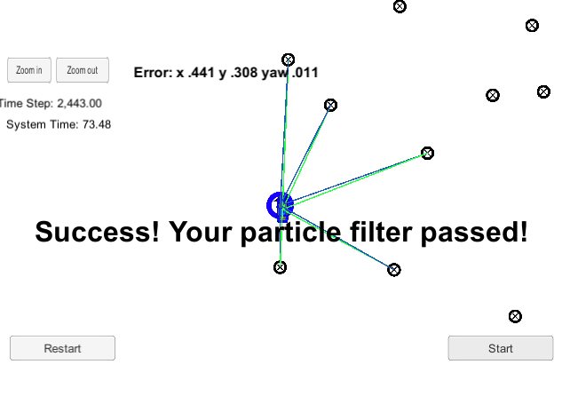
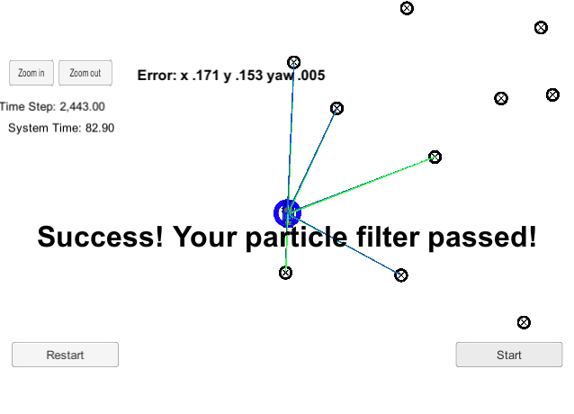

# Kidnapped Vehicle

This project is a particle filter implementation to predict and update the position of the car (Localization) and the steps are as follows:

1. Create random(Gaussian Distribution) particle objects after getting GPS position
2. After getting sensor measurement of surrounding objects(car coordinate), convert that back to Map coordinate
3. Calculate the weight of each particle with sensor measurement(given converted Map coordinate above) the closer real positions, the higher weight
4. Resample the particles from the calculated weight
5. repeat 

## Running the Code
This project involves the Term 2 Simulator which can be downloaded [here](https://github.com/udacity/self-driving-car-sim/releases)

This repository includes two files that can be used to set up and install uWebSocketIO for either Linux or Mac systems. For windows, you can use either Docker, VMware, or even Windows 10 Bash on Ubuntu to install uWebSocketIO.

Once the install for uWebSocketIO is complete, the main program can be built and ran by doing the following from the project top directory.

1. mkdir build
2. cd build
3. cmake ..
4. make
5. ./particle_filter

Alternatively, some scripts have been included to streamline this process, these can be leveraged by executing the following in the top directory of the project:

1. ./clean.sh
2. ./build.sh
3. ./run.sh

The directory structure of this repository is as follows:

```
├── CMakeLists.txt
├── LICENSE
├── README.md
├── build.sh
├── clean.sh
├── cmakepatch.txt
├── data
│   └── map_data.txt
├── install-mac.sh
├── install-ubuntu.sh
├── run.sh
└── src
    ├── helper_functions.h
    ├── json.hpp
    ├── main.cpp
    ├── map.h
    ├── particle_filter.cpp
    └── particle_filter.h
```

## Result

Number of particle `20`

`Error: x .441, y .308, yaw .011`



Number of particle `100`

`Error: x .171, y .153, yaw .005`



The more number of particles, the better of the result in term of error calculation, however, higher time processing which is due to a calculation time that happens in all particles. 
